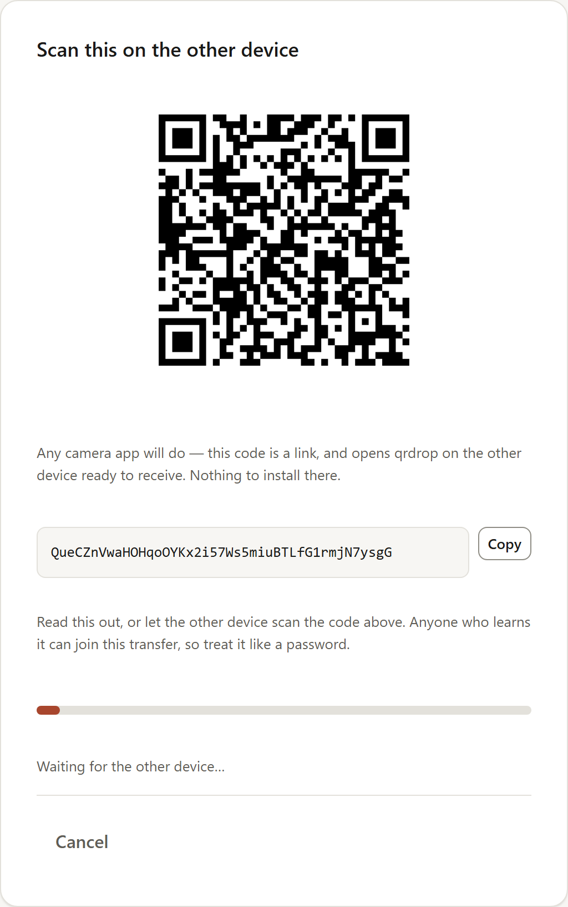
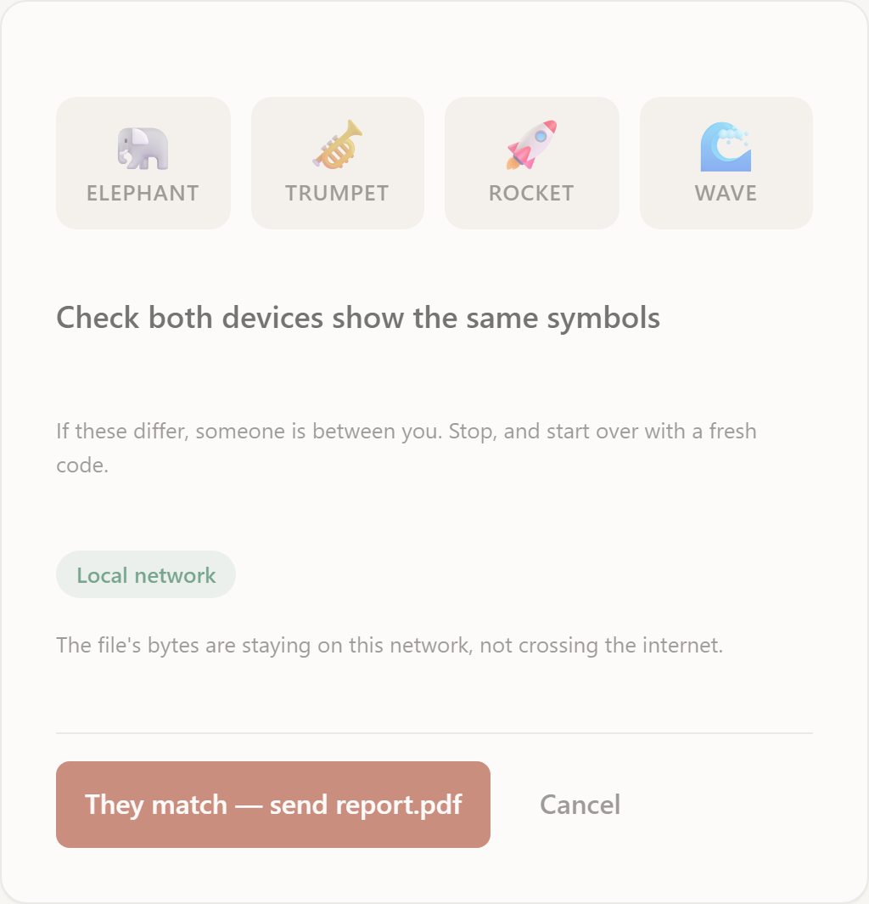
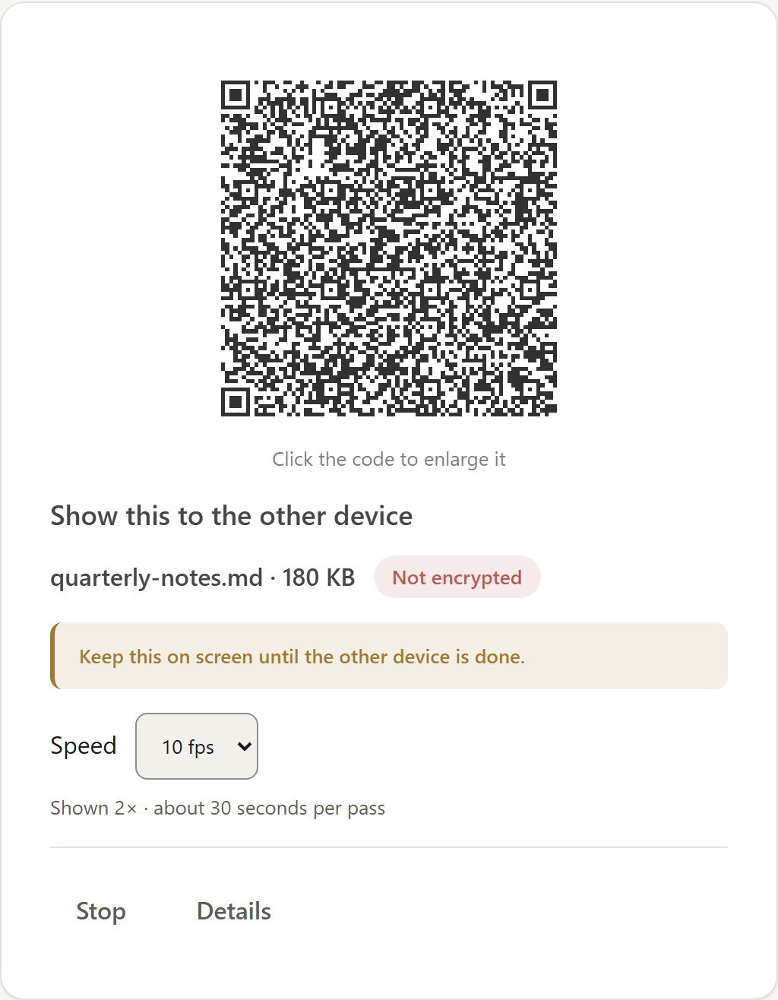
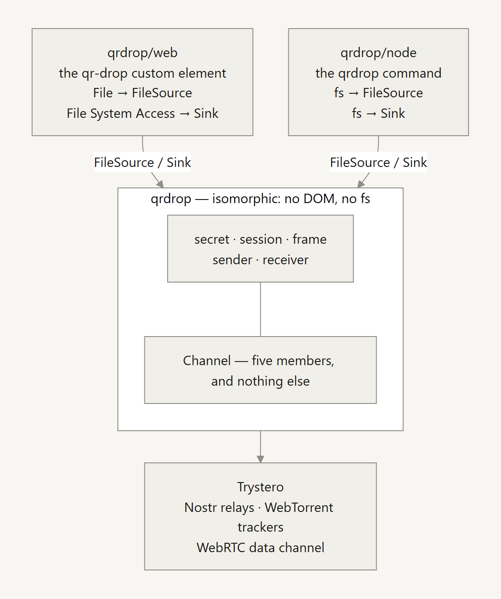
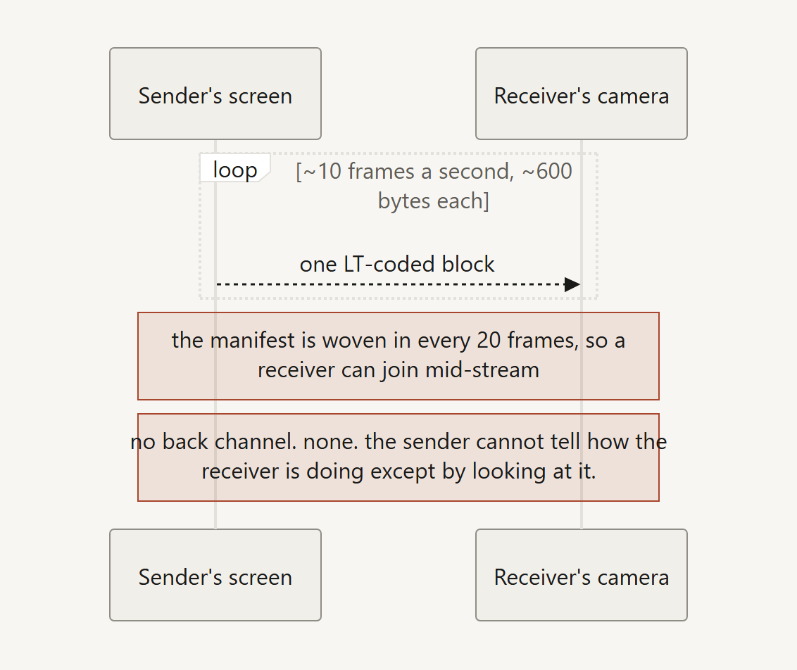

<h1 align="center">qrdrop</h1>

<p align="center">
  Send a file straight from one device to another.<br>
  A QR code carries the key; the file goes over WebRTC;<br>
  nothing in between ever holds a readable copy.
</p>

<p align="center">
  <a href="https://www.npmjs.com/package/qrdrop"></a>
  <a href="https://github.com/stan-ely/qrdrop/actions/workflows/ci.yml"></a>
  
  <a href="#licence"></a>
</p>

<p align="center">
  <b><a href="https://share.stan-ely.com">share.stan-ely.com</a></b> — no install, no account, no upload.
</p>

```bash
npx qrdrop send report.pdf     # prints a QR code in your terminal
npx qrdrop receive             # on the other machine
npx qrdrop web                 # or run the browser UI locally, from this copy
```

A file sent from the CLI can be received in a browser, and the other way round.
That interoperability is the reason this is one package rather than three.

| Where | How |
| --- | --- |
| **Browser** | [share.stan-ely.com](https://share.stan-ely.com), or `<qr-drop>` in a page of your own |
| **Terminal** | `npx qrdrop send` / `receive` — the QR is printed as text |
| **Library** | `import { openRoom, sendFile, createReceiver } from 'qrdrop'` |
| **Air-gapped** | [**Beam**](#no-network-at-all) — animated QR on one screen, a camera on the other |

<!-- Generated by scripts/make-screenshots.mjs from the real component, not mocked up.
     A table rather than three loose images: it is the one layout that puts them in a
     row on GitHub and does not collapse to a wall of full-width pictures on npm. -->
| <picture><source media="(prefers-color-scheme: dark)" srcset="docs/screenshots/send.dark.png"></picture> | <picture><source media="(prefers-color-scheme: dark)" srcset="docs/screenshots/verify.dark.png"></picture> | <picture><source media="(prefers-color-scheme: dark)" srcset="docs/screenshots/beam.dark.png"></picture> |
| --- | --- | --- |
| Show the code | Match the words | Beam, for no network |

**Contents** ·
[How it works](#how-it-works) ·
[Three faces, one protocol](#three-faces-one-protocol) ·
[No network at all](#no-network-at-all) ·
[Threat model](#threat-model) ·
[Development](#development) ·
[Design notes](#design-notes) ·
[Known limitations](#known-limitations) ·
[Layout](#layout)

---

## How it works

Two devices in the same room. One shows a QR code, the other points a camera at
it, and that scan is the one channel an attacker cannot stand in the middle of.

<!-- Source: docs/diagrams/handshake.mmd, rendered by scripts/make-diagrams.mjs.
     A ```mermaid fence would be tidier and renders on GitHub, but not on npm,
     which shows this README too. The alt text is the diagram in words -- it is
     what a screen reader gets, and what the ASCII sketch this replaced gave. -->
<picture>
  <source media="(prefers-color-scheme: dark)" srcset="docs/diagrams/handshake.dark.png">
  
</picture>

The QR carries 32 bytes of CSPRNG output. Everything else derives from it:

| Derivation | Purpose |
| --- | --- |
| `HKDF(secret, "topic")` | Trystero room ID — what peers meet on |
| `HKDF(secret, "signal")` | Trystero `password`, encrypting session descriptions |
| `HKDF(ECDH, salt=secret, "host->guest")` | file bytes, sender to receiver |
| `HKDF(ECDH, salt=secret, "guest->host")` | file bytes, the other way |
| `HKDF(ECDH, salt=secret, "sas")` | the four emoji shown on both screens |

The room ID is derived rather than being the secret itself. Using the secret as
the room name is the obvious shortcut, works perfectly in testing, and silently
publishes your key to every relay on the network.

### Why `password` is not optional

Trystero owns the session descriptions, so we cannot seal the SDP ourselves.
`password` is what replaces that. Without it Trystero derives its key from the
app ID and room name — both of which any relay observer already has — which
would leave the DTLS fingerprint substitutable in transit. That substitution is
the textbook man-in-the-middle on WebRTC signalling, and it is the thing the QR
code exists to prevent.

### Why file chunks are encrypted again on top

Two layers that fail independently. Ephemeral ECDH per session gives forward
secrecy — a code photographed later cannot decrypt a transfer that already
happened — and it uses the QR secret as its HKDF salt, so even if Trystero's
signalling encryption were broken outright an attacker would still need the code
to derive the session key.

"Per session" is the load-bearing word, and it rests on one line: the keypair is
generated inside `joinVia`, per call, and thrown away with the room. Since
`openRoom` races two signalling networks at once, one pairing generates two
keypairs and discards one — which makes lifting that line to module scope look
like an easy saving and would quietly turn every transfer a process ever made
into one long session. `test/room.test.mjs` pairs twice over the same secret
against an in-memory signalling strategy and asserts the second session cannot
decrypt the first's traffic, so that edit fails a test in two seconds rather than
surviving to a release.

DTLS also terminates at the peer's browser, and when NAT traversal fails packets
pass through a third-party TURN relay. Sealing each chunk ourselves means a
relay operator sees ciphertext and byte counts, never contents.

Nonces are unique by counting rather than by chance — `fileSeq || chunkIndex`,
with a separate key per direction — because AES-GCM does not degrade gracefully
under nonce reuse. The end-of-file flag is authenticated, so an attacker who
stops forwarding frames cannot pass a truncated file off as complete.

### Two gestures, and why neither is decorative

The sender confirms the four-emoji SAS before a manifest goes out — the manifest
alone would disclose the filename and size. The receiver accepts, which is also
the click that permits `showSaveFilePicker` to open, and that is what lets large
files stream to disk instead of accumulating in memory.

> [!IMPORTANT]
> Both gestures survive into the CLI as stdin prompts. `--yes` skips the accept
> prompt and **cannot** skip the SAS confirmation: the SAS is the entire
> man-in-the-middle defence, so a flag that skipped it would be a vulnerability
> wearing a convenience's clothes.

## Three faces, one protocol

```js
import { openRoom, sendFile, createReceiver } from 'qrdrop'        // isomorphic
import { defineQRDrop, fromFile } from 'qrdrop/web'                // browser
import { fromPath, createFileSink } from 'qrdrop/node'             // Node
```

<!-- Source: docs/diagrams/entries.mmd, rendered by scripts/make-diagrams.mjs.
     A ```mermaid fence would be tidier and renders on GitHub, but not on npm,
     which shows this README too. The alt text is the diagram in words -- it is
     what a screen reader gets, and what the ASCII sketch this replaced gave. -->
<picture>
  <source media="(prefers-color-scheme: dark)" srcset="docs/diagrams/entries.dark.png">
  
</picture>

The `qrdrop` entry is the protocol and the transport, and it touches neither a
DOM nor an `fs`. That is enforced rather than asserted: `src/core/` and
`src/transport/` are typechecked twice, once with `types: []` and no Node lib
and once with Node's globals, so a stray `Buffer` in code destined for a browser
fails the build instead of throwing at runtime.

What is deliberately *not* in that entry is anything that knows where bytes come
from or go to. `sendFile` takes a `FileSource`, `createReceiver` takes a
`createSink`, and each runtime supplies its own. That is the whole trick behind
having a CLI at all.

### Drop the UI into a page

```html
<script type="module">
  import { defineQRDrop } from 'qrdrop/web'
  defineQRDrop()
</script>

<qr-drop></qr-drop>
```

A custom element with its own shadow root, so it brings its styles with it and
collides with nothing. No framework, and no framework adapter to keep up to
date — every framework already renders a custom element.

### Run the browser UI locally

`npx qrdrop web` serves the same browser UI that [share.stan-ely.com](https://share.stan-ely.com)
deploys, from the package you just installed, on `http://127.0.0.1:4173` — nothing
is uploaded and no other device can reach it. It is the way to use the browser
flow while running code you can read first.

| Flag | |
| --- | --- |
| `--port <n>` | changes the port; `0` picks a free one |
| `--no-open` | prints the URL instead of opening a browser |
| `Ctrl-C` | stops it |

Loopback only, by design: `http://<lan-ip>` is not a secure context, so
WebCrypto and the camera would fail there.

## No network at all

Everything above assumes a network. On an air-gapped machine there is none, so
there is no transfer. **Beam** is the answer to that, and it is a separate mode
rather than a fallback: the sender animates QR codes on screen, the receiver
points a camera at them, and nothing crosses a wire.

<!-- Source: docs/diagrams/beam.mmd, rendered by scripts/make-diagrams.mjs.
     A ```mermaid fence would be tidier and renders on GitHub, but not on npm,
     which shows this README too. The alt text is the diagram in words -- it is
     what a screen reader gets, and what the ASCII sketch this replaced gave. -->
<picture>
  <source media="(prefers-color-scheme: dark)" srcset="docs/diagrams/beam.dark.png">
  
</picture>

Beam is reached from the browser UI only — `qrdrop web`, then the page's "No
network? Show it as a QR code" or "Scan a beamed file". There is no `qrdrop
beam` command, and there will not be one: the mode needs a screen to animate
and a camera watching it, which a terminal on the receiving end does not have.

> [!WARNING]
> **Beam is not encrypted, and it cannot be.** There is no handshake, so there
> is no ECDH, no forward secrecy, and no SAS — there is no peer to
> authenticate, only photons. The only adversary is someone who can see the
> screen, and a key shown on that same screen does not stop them. The UI says
> so on both beam screens. Everything else in this document about
> confidentiality applies to the WebRTC path and not to this one.

### What to expect

About **6 kB/s**, and a **1 MiB cap** applied after compression. Files are gzipped
first and the result kept only if it actually shrank, so text, CSV, JSON and
source typically compress 3–10× and a several-megabyte log file is fine, while a
900 KB JPEG is refused. `test/beam.test.mjs` pins the loss behaviour, including
the case where a manifest under-declares its own decompressed size.

gzip rather than brotli, though brotli is smaller and is now in the WHATWG
Compression Standard: a one-way channel cannot negotiate. The sender picks blind
and the receiver either can inflate it or cannot, and brotli is Safari 18.4+ and
Firefox 147+ with Chrome behind. Twenty-five seconds off a three-minute transfer
is not worth a failure whose only remedy is "try a different browser".

A fountain code has no ordering, so the decoder holds every block in memory
until peeling completes — the second reason for the cap. Raising it wants
independent ~256 KiB windows so memory stays bounded and each can be flushed as
it solves; that is not built.

### Why a fountain code

The obvious design is to number the chunks and loop them forever, as [qrbeam](https://www.npmjs.com/package/qrbeam)
does. That is a coupon-collector problem: gathering the last few of N chunks
means re-watching the whole loop repeatedly, so completion costs about `N·ln(N)`
frames. Frames *are* dropped — jsQR needs 50–100 ms per frame, so a Firefox
phone manages about ten decodes a second against a display emitting exactly
that.

The transfer is an LT code instead, so a frame does not care *which* frames were
missed, only how many arrived. Measured over 1748 blocks (a 1 MiB payload),
frames the sender must emit before the receiver has the file:

| frame loss | this codec | numbered chunks on a loop |
| --- | --- | --- |
| 0% | **1.05 × N** | 1.00 × N |
| 10% | **1.48 × N** | 8.3 × N |
| 30% | **2.08 × N** | 10.7 × N |
| 50% | **2.81 × N** | 14.9 × N |

The first N frames are the source blocks sent plain, and only then does the
fountain start. txqr does not do this, and the trade is real rather than a free
win: the decoder then needs ~1.3 distinct frames per block under loss, against
the ~1.15 a pure LT code reaches, because most blocks are already solved by the
time the fountain begins and a degree-d frame therefore carries fewer unknowns
than its degree suggests. What it buys is the common case — a clean capture
costs exactly N frames and nothing more. Which side of that is right depends on
how good you expect the camera to be, and this bets on it being good.

### Prior art, and what is actually ours

Neither the idea nor the design is original here, and it would be tidier but
dishonest to present them that way.

The prompt was **[qrbeam](https://www.npmjs.com/package/qrbeam)**, which sends a
file offline as animated QR codes to an iOS receiver. That is where the idea of
adding this to qrdrop came from. Its wire format numbers the chunks and loops
them, which is what the table above compares against — named, because a
benchmark against an unnamed strawman is worth less to a reader and is unfair to
the party being measured.

**[txqr](https://github.com/divan/txqr)** by Ivan Daniluk got to the fountain
code first, and it is the closest prior art to what is built here: animated QR
frames carrying [LT-coded](https://en.wikipedia.org/wiki/Luby_transform_code)
blocks, so the receiver needs *enough* frames rather than *particular* ones. The
[write-up on fountain codes and animated QR](https://divan.dev/posts/fountaincodes/)
is the better explanation of why this works and is worth reading before this
section. The reasoning above was arrived at independently, which makes it
convergent rather than novel — no code was taken from either project.

What differs here is small and worth stating plainly rather than dressing up:
the first N frames are systematic, compression is decided by measurement, the
manifest is interleaved so a receiver can join mid-stream, and both halves run
in a browser with no install on either side.

## Threat model

> [!NOTE]
> Everything below describes the **WebRTC path**. The beam mode above shares
> none of it — see that section.

**Protected**

- Relay operators and TURN servers see ciphertext, timing, and volume only.
- A network attacker without the QR cannot join, read, or MITM the transfer.
- Past transfers stay closed if the code leaks afterwards.
- Truncated, reordered, or altered files are rejected, not silently written.

**Not protected**

- **Anyone with the code can join.** It is the entire credential. Show the QR to
  a person, not to a room.
- **The host serving the page could serve modified code.** No in-browser design
  prevents that. It is mitigated by a strict CSP, no inline scripts, a small
  auditable surface, and shipped source maps — the deployed bundle is readable
  in devtools, so the claims here can be checked against what is actually
  running rather than against this repository. Mitigated, not eliminated.
- **Both peers learn each other's IP.** Inherent to a direct connection. A
  connection that falls back to TURN hides each IP from the other but shows both
  to the relay operator; forcing that path for everyone would need
  `iceTransportPolicy: 'relay'`, left opt-in.
- **Which route the bytes took is now shown, with a caveat.** Both surfaces
  report the path read off the nominated ICE candidate pair: *Local network*
  (both ends on a host candidate), *Direct, over the internet* (reached through
  NAT), *Through a public relay* (TURN), or *Path unknown*. Treat "Local
  network" as evidence, not proof — a host candidate can also belong to a VPN,
  Tailscale, or container interface, which is a local *interface* rather than a
  local *network*, so the copy never promises the transfer is free. The two peers do
  not see the same evidence: Firefox withholds the address of a peer-reflexive
  candidate, so the side that could not resolve the other's mDNS `.local` name
  can only answer "unknown" about a connection the other side describes
  exactly. Each peer therefore classifies its own end, sends the verdict as a
  sealed `path` control message, and both show the combination — evidence beats
  absence (`local` + `unknown` → `local`), and a genuine conflict resolves the
  expensive way (`local` + `direct` → `direct`), because being wrongly warned
  about data cost is an annoyance and being wrongly told a metered transfer is
  free is a bill. A peer that never sends one is not an error; nothing waits on
  it.

  Set `?debug=path` in the query string (never the fragment, which is where the
  secret lives) to see the raw candidate pairs behind a verdict on either
  device. Addresses are reported as a category — `mdns`, `ipv4-rfc1918`,
  `ipv4-cgnat`, `ipv4-public` — rather than as values, so a dump can be shared
  while diagnosing without disclosing anyone's network. "Local"
  describes the file bytes only: pairing always crossed the internet, over a
  public signalling network. "Path unknown" means this device could not read
  the stats — the ordinary answer under `node-datachannel`, and not a fault.
- **Relays and trackers see metadata**: that two throwaway keys met on a room,
  when, and roughly how much moved.
- **Beam transfers are in the clear.** No handshake means no key agreement and
  no SAS. Anyone who can see the sender's screen — or a photograph of it, or a
  camera in the room — has the file. It is offered for air-gapped machines,
  where the alternative is a USB stick, not as a private channel.

The CLI avoids the browser-delivery problem entirely: it is a versioned tarball
you can pin, audit, and check the provenance of. Releases are published with
`npm publish --provenance`, so the tarball is tied to the workflow run and
commit that built it.

## Development

```bash
npm install
npm test            # unit suite, offline
npm run typecheck   # two tsc runs, browser and Node; nothing is compiled
npm run build       # esbuild -> site/dist/
npm start           # build, then serve site/dist/ on :4173
```

`localhost` counts as a secure context, so WebCrypto and the camera both work
against `npm start` without a certificate.

The end-to-end suites need a network and the goodwill of public Nostr relays,
so they are kept out of `npm test` and out of CI — a red tick for reasons that
have nothing to do with this code teaches everyone to ignore red ticks.

```bash
npm run test:e2e          # two real browsers, over real relays
npm run test:e2e:interop  # two Node processes driving the CLI end to end
```

<details>
<summary><b>Why the interop suite spawns two processes</b></summary>

Trystero computes `selfId` once per module instance, so two rooms sharing a
process also share an identity: each sees the other's announcement carrying its
own id, discards it as itself, and they wait for each other until the timeout.
That is a property of Trystero rather than a bug here, but it is invisible
until you try it.

</details>

<details>
<summary><b>Type checking without a build step</b></summary>

`tsc --noEmit` with `checkJs` over the JSDoc. The published sources are plain ES
modules, unbundled and untranspiled; only the site's browser bundle is built.

There are three configs because there are three runtimes, and `src/core/` and
`src/transport/` deliberately appear in two of them. Being checked once without
Node globals and once with them is what makes "isomorphic" a property the build
enforces rather than a claim in a comment.

</details>

<details>
<summary><b>Deploying</b></summary>

`npm run build` produces a self-contained `site/dist/`. Serve it over HTTPS —
WebCrypto and the camera are unavailable otherwise.

**GitHub Pages serves no custom headers**, so `site/_headers` is inert there:
`frame-ancestors`, `X-Frame-Options`, `Referrer-Policy`, and
`Permissions-Policy` are simply not set on share.stan-ely.com. Framing is still
blocked, because `site/main.js` refuses to run inside a frame — that check
exists precisely for hosts that cannot set the header. The rest are
defence-in-depth rather than load-bearing, and `_headers` is kept for anyone
deploying the same build to Cloudflare Pages or Netlify, which do read it.

The CSP is unaffected either way: it is delivered in a `<meta>` tag generated at
build time, so it survives a host that sets no headers at all.

</details>

## Design notes

### The transport seam

Everything in `src/core/` is written against one interface and nothing else:
`Channel` in `types/qrdrop.d.ts`. Five members — `send`, `bufferedAmount`,
`bufferedAmountLowThreshold`, and the `addEventListener` / `removeEventListener`
pair.

That seam is why replacing the entire signalling layer — hand-rolled Nostr plus
WebRTC negotiation, for Trystero — cost 11 lines across all of the transfer code
and nothing at all in the framing, session, control, digest, or sink modules.
The security core was untouched by a total rewrite beneath it.

> [!IMPORTANT]
> The one subtlety worth knowing before writing another transport:
> **backpressure may be signalled either way, but it must be signalled.** A
> transport can defer the promise returned by `send`, or it can report
> `bufferedAmount` and fire `bufferedamountlow` — Trystero does the former, a
> raw `RTCDataChannel` the latter. A transport that does neither will let a
> large file queue entirely into memory and take the tab down.
> `test/channel.test.mjs` runs a full sealed transfer over a channel with
> exactly those five members and nothing else, so a new transport finds out
> what it is missing there rather than against a live relay.

<details>
<summary><b>More than one signalling network, raced</b></summary>

Trystero ships a package per strategy behind an identical `joinRoom` interface,
so `src/transport/room.js` lists them in `STRATEGIES` — Nostr relays and
WebTorrent trackers today — and `openRoom` joins all of them at once, pairs on
whichever completes the handshake first, and tears the rest down. Both peers are
present on every network simultaneously, so no agreement on *which* network is
needed; a sequential fallback could not promise that. The tracker strategy
shares Trystero's core and costs ~2 kB gzipped; `/mqtt` was measured at ~112 kB
and left out, `/ws-relay` would mean running a server. Adding a strategy is one
entry in `STRATEGIES` and its URL list — the CSP follows automatically, because
`scripts/build-site.mjs` generates `connect-src` from `SIGNALING_URLS` (every
strategy's URLs, reduced to origins) rather than a second list kept in step by
hand.

</details>

<details>
<summary><b>Relay choice was measured, not assumed</b></summary>

The best-known Nostr relays — `relay.damus.io`, `relay.nostr.band`,
`relay.snort.social` — were all unreachable when the list was built. The seven
in `room.js` were picked by connecting to every relay in Trystero's pool and
keeping the ones that answered. The tracker list is seeded from
`@trystero-p2p/torrent`'s defaults and has not had the same publish-test
scrutiny yet.

**Measure by publishing, not by connecting.** `relay.nostr.place` was dropped
after it began demanding proof-of-work (NIP-13) on writes. It still accepts
connections and still answers reads, so a connectivity probe calls it healthy —
it just cannot be used to announce a peer, which is the only thing a relay is
needed for here. A socket that opens is not a relay that works.

</details>

**The confidentiality path uses WebCrypto only** — P-256, HKDF, AES-GCM, no
third-party code. Trystero sits below that boundary: it protects signalling, but
a compromise there could not read a file byte.

### Sources and sinks

The mirror-image pair that make one protocol serve three runtimes.

`FileSource` is three fields and a range read; `Sink` is a name, a `write`, a
`close`, and an `abort`. `sendFile` and `createReceiver` know nothing else about
where bytes live. The browser supplies File System Access with a Blob fallback;
Node supplies `fs`; the tests supply arrays.

`createSink` is a *required* argument to `createReceiver` rather than a
defaulted one. Defaulting it to the browser implementation is what quietly made
the protocol layer depend on the DOM in the first place, and making every call
site answer the question out loud is what stopped it.

## Known limitations

- **Firefox and Safari buffer received files in memory** before saving, capping
  practical transfers around a gigabyte. Chromium streams to disk via the File
  System Access API. Closing this needs a Service Worker that fabricates a
  streaming download response. The CLI has no such limit.
- **The streaming save path has no automated test.** Headless Chromium exposes
  `showSaveFilePicker` but has no UI to answer it, so the e2e forces the
  in-memory fallback.
- **The e2e suites depend on public Nostr relays**, so they need a network and
  fail for reasons unrelated to this code. Pointing them at
  `@trystero-p2p/ws-relay` against a local WebSocket server would make them
  deterministic and offline; worth keeping one Nostr run as a smoke test.
- **TURN is free, shared, and metered.** Roughly 10–15% of NAT pairings can't
  connect directly and fall back to the Open Relay Project's public TURN
  (static credentials, no signup). Because that bandwidth isn't ours, a transfer
  that ends up relayed is capped at 100 MB — the sender refuses and the receiver
  auto-declines a larger file. A direct connection has no such limit. There is
  no resume yet, so an interrupted transfer restarts from zero.
- **The metered warning and the TURN cap are different numbers on purpose.**
  Above 25 MB (`METERED_WARN_BYTES`) on a *direct* or *relay* path, both
  surfaces say so before the transfer starts — that threshold protects the
  user's data allowance, where the 100 MB cap protects free infrastructure.
  Collapsing them into one constant looks tidy and would let a 90 MB transfer
  over mobile data go out in silence. The warning is deliberately silent on a
  *local* path, and on *unknown*: warning about a route we've just said we can't
  identify would fire on every large CLI send and train the message into
  wallpaper. It is text beside the existing gestures, never a second click.
- **One file at a time.** The framing supports a file sequence; neither the UI
  nor the CLI exposes it yet.

## Layout

```
src/index.js                 the isomorphic entry -- no DOM, no fs
src/core/secret.js           QR secret, HKDF derivations
src/core/session.js          ephemeral ECDH, directional keys, SAS
src/core/frame.js            per-chunk AEAD, nonce construction
src/core/sender.js           chunking, backpressure, accept handshake
src/core/receiver.js         demux, verification, sink management
src/core/source.js           the FileSource contract
src/transport/room.js        Trystero pairing, relay list, ICE
src/transport/channel.js     the transport seam, on its own
src/web/element.js           <qr-drop>, shadow DOM, the screen flow
src/web/sink.js              File System Access, with a Blob fallback
src/node/                    fs sink, fs source, terminal QR, WebRTC polyfill
src/cli.js                   the qrdrop command

site/index.html              the page; CSP placeholder filled in at build
scripts/build-site.mjs       esbuild, and the generated CSP
types/qrdrop.d.ts            the Channel contract, and shared types
```

## Contributing

Bug reports and pull requests are welcome -- [CONTRIBUTING.md](CONTRIBUTING.md)
covers the house style and the invariants a change can break silently.
Vulnerabilities go privately through [SECURITY.md](SECURITY.md), not to the
issue tracker. Release notes are in [CHANGELOG.md](CHANGELOG.md).

## Licence

MIT.
