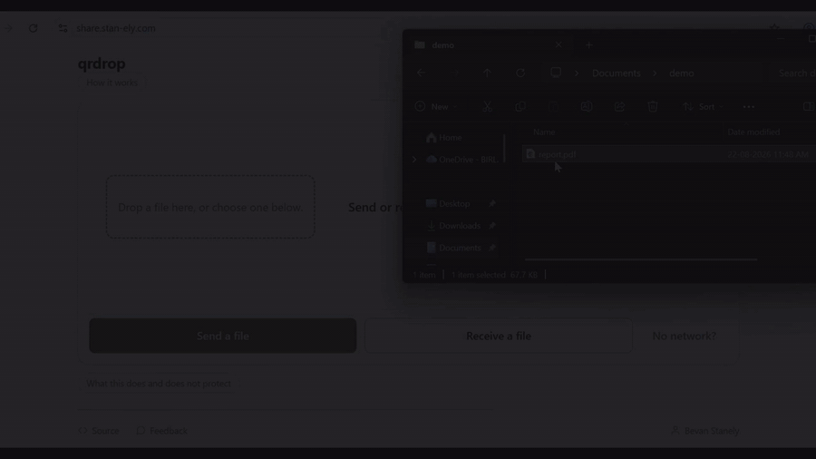

<h1 align="center">qrdrop</h1>

<p align="center">
  Send a file straight from one device to another.<br>
  A QR code carries the key; the file goes over WebRTC;<br>
  nothing in between ever holds a readable copy.
</p>

<p align="center">
  <a href="https://www.npmjs.com/package/qrdrop"></a>
  <a href="https://github.com/stan-ely/qrdrop/actions/workflows/ci.yml"></a>
  
  <a href="#licence"></a>
</p>

<p align="center">
  <b><a href="https://share.stan-ely.com">share.stan-ely.com</a></b> — no install, no account, no upload.
</p>

<!-- One real transfer, captured from both ends and cut together by hand from
     docs/demo/loop/ (recipe: docs/demo/loop/README.md); not regenerated in CI.
     site/loop.mp4 / site/loop.webm are the same clip, for the site hero. A GIF
     rather than a <video> tag because github.com will not play a repo-relative
     <video> and npm plays neither; docs/loop.poster.png is the still fallback
     for the npm page. The alt text is the clip in words. -->
<p align="center">
  
</p>

```bash
npx qrdrop send report.pdf     # prints a QR code in your terminal
npx qrdrop receive             # on the other machine
```

<!-- Generated by scripts/make-screenshots.mjs from the real component, not mocked up.
     A table rather than three loose images: it is the one layout that puts them in a
     row on GitHub and does not collapse to a wall of full-width pictures on npm. -->
| <picture><source media="(prefers-color-scheme: dark)" srcset="docs/screenshots/send.dark.png"></picture> | <picture><source media="(prefers-color-scheme: dark)" srcset="docs/screenshots/verify.dark.png"></picture> | <picture><source media="(prefers-color-scheme: dark)" srcset="docs/screenshots/beam.dark.png"></picture> |
| --- | --- | --- |
| Show the code | Match the words | Beam, for no network |

## Install

Nothing to install for the browser: open [share.stan-ely.com](https://share.stan-ely.com)
on both devices. Everything else, by where you are:

| | |
| --- | --- |
| **Any machine with Node 22+** | `npx qrdrop send report.pdf` and `npx qrdrop receive` — the QR is printed in the terminal |
| **CLI on `PATH`** | `brew install stan-ely/tap/qrdrop` · `scoop install stan-ely/qrdrop` (after `scoop bucket add stan-ely https://github.com/stan-ely/scoop-bucket`) · `npm i -g qrdrop` |
| **Browser UI, run locally** | `npx qrdrop web` — serves this copy on `127.0.0.1` |
| **Windows app** | [Microsoft Store](https://apps.microsoft.com/detail/9NWB4J802031) · `scoop install stan-ely/qrdrop-app` · [Releases](https://github.com/stan-ely/qrdrop/releases) |
| **macOS app** (Apple silicon) | `brew install --cask stan-ely/tap/qrdrop-app` · [Releases](https://github.com/stan-ely/qrdrop/releases) |
| **Android app** | [F-Droid repository](docs/app.md#install) (this project's own, same signed APK) · [Releases](https://github.com/stan-ely/qrdrop/releases) |
| **Linux app** | `.deb` and AppImage on [Releases](https://github.com/stan-ely/qrdrop/releases) — Beam only; the webview has no WebRTC |

A file sent from the CLI can be received in a browser, and the other way round.
That interoperability is the reason this is one package rather than three.

| Where | How |
| --- | --- |
| **Browser** | [share.stan-ely.com](https://share.stan-ely.com), or `<qr-drop>` in a page of your own |
| **Terminal** | `npx qrdrop send` / `receive` — the QR is printed as text |
| **Library** | `import { openRoom, sendFile, createReceiver } from 'qrdrop'` |
| **Air-gapped** | [**Beam**](docs/beam.md) — animated QR on one screen, a camera on the other |
| **App** | [A desktop and mobile shell](docs/app.md) — a real file picker, the system camera, and scanned links that open it |

## What is in here

- **One protocol, three runtimes.** The same `src/core/` runs in a browser, in
  Node and in a Tauri app, and is typechecked twice — with and without Node's
  globals — so "isomorphic" is a build failure rather than a promise.
  [Protocol](docs/protocol.md#three-faces-one-protocol)
- **Keys from a QR code, checked by eye.** 32 random bytes in the code, HKDF for
  everything else, an ephemeral ECDH per session, per-chunk AES-GCM on top of
  WebRTC's own encryption, and a four-emoji SAS that gets exactly one attempt per
  secret. WebCrypto only. [Protocol](docs/protocol.md) ·
  [Threat model](docs/threat-model.md)
- **A fountain code for no network at all.** Beam animates LT-coded QR frames, so
  a receiver needs *enough* frames rather than *particular* ones — 1.48 × N
  frames at 10% loss, against 8.3 × N for numbered chunks on a loop.
  [Beam](docs/beam.md)
- **No framework, four runtime dependencies.** The UI is a custom element over a
  hand-rolled virtual DOM, laid out to never scroll, and checked by a script that
  walks every screen in Chromium and Firefox, at four viewports, with a mouse and
  with touch.
- **Shipped where people are.** npm with provenance, Homebrew, Scoop, the
  Microsoft Store, and a self-hosted F-Droid repository whose APK is built
  reproducibly — two builds in different directories are byte-identical.
  [The app](docs/app.md)

## How it works

Two devices in the same room. One shows a QR code, the other points a camera at
it, and that scan is the one channel an attacker cannot stand in the middle of.

<!-- Source: docs/diagrams/handshake.mmd, rendered by scripts/make-diagrams.mjs.
     A ```mermaid fence would be tidier and renders on GitHub, but not on npm,
     which shows this README too. The alt text is the diagram in words -- it is
     what a screen reader gets, and what the ASCII sketch this replaced gave. -->
<picture>
  <source media="(prefers-color-scheme: dark)" srcset="docs/diagrams/handshake.dark.png">
  
</picture>

The QR carries 32 bytes of CSPRNG output. Everything else derives from it:

| Derivation | Purpose |
| --- | --- |
| `HKDF(secret, "topic")` | Trystero room ID — what peers meet on |
| `HKDF(secret, "signal")` | Trystero `password`, encrypting session descriptions |
| `HKDF(ECDH, salt=secret, "host->guest")` | file bytes, sender to receiver |
| `HKDF(ECDH, salt=secret, "guest->host")` | file bytes, the other way |
| `HKDF(ECDH, salt=secret, "sas")` | the four emoji shown on both screens |

The room ID is derived rather than being the secret itself. Using the secret as
the room name is the obvious shortcut, works perfectly in testing, and silently
publishes your key to every relay on the network.

Both devices then show the same four emoji, and the sender confirms they match
before the filename or size is sent. The receiver's Accept is the only other
gesture. Why each of those steps is there, and what breaks without it, is in
[docs/protocol.md](docs/protocol.md).

## Threat model

**Protected:** relays and TURN servers see ciphertext, timing and volume only; a
network attacker without the QR cannot join, read or tamper with a transfer;
past transfers stay closed if a code leaks afterwards; truncated, reordered or
altered files are rejected rather than written.

**Not protected:** anyone holding the code can join — it is the whole
credential, so show it to a person and not to a room or a screen share; both
peers learn each other's IP address; the host serving the page could serve
modified code; relays see that two keys met.

> [!WARNING]
> **Beam is not encrypted, and cannot be.** There is no handshake on a one-way
> channel. It is for air-gapped machines, where the alternative is a USB stick.

The full version, including how long a code stays useful and what the route
indicator can and cannot tell you, is [docs/threat-model.md](docs/threat-model.md).
Vulnerabilities go privately through [SECURITY.md](SECURITY.md).

## Development

```bash
npm install
npm test            # unit suite, offline
npm run typecheck   # two tsc runs, browser and Node; nothing is compiled
npm run build       # esbuild -> site/dist/
npm start           # build, then serve site/dist/ on :4173
```

`localhost` counts as a secure context, so WebCrypto and the camera both work
against `npm start` without a certificate. The end-to-end suites
(`npm run test:e2e`, `npm run test:e2e:interop`) need a network and public Nostr
relays, so they stay out of `npm test` and out of CI.
[CONTRIBUTING.md](CONTRIBUTING.md) has the house style, the source layout, and
the rules a change can break silently.

## Documentation

| | |
| --- | --- |
| [Protocol](docs/protocol.md) | Pairing, key derivation, framing, the transport seam, sources and sinks |
| [Threat model](docs/threat-model.md) | What is and is not protected, and known limitations |
| [Beam](docs/beam.md) | The no-network mode: the fountain code, its measurements, and prior art |
| [The app](docs/app.md) | Desktop and mobile installs, what works on each platform, signing |
| [Hosting](docs/hosting.md) | Running the site bundle yourself, and how share.stan-ely.com is deployed |
| [app/CAPABILITIES.md](app/CAPABILITIES.md) | The app's lab notebook: every platform measurement, phase by phase |
| [CHANGELOG.md](CHANGELOG.md) · [app/CHANGELOG.md](app/CHANGELOG.md) | Release notes for the npm package and the app |

## Licence

MIT.
